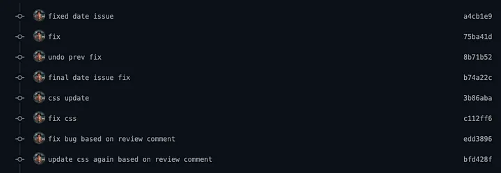
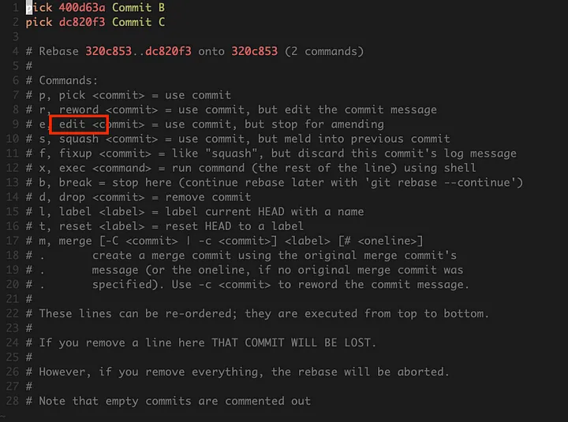
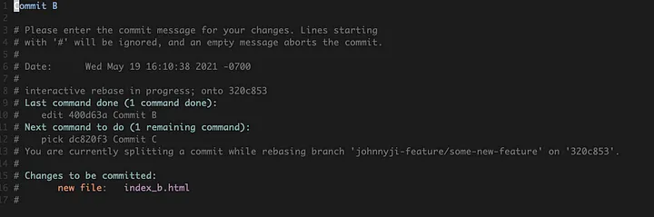
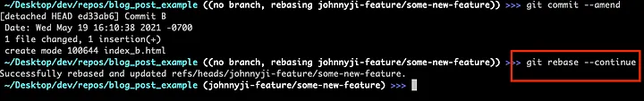
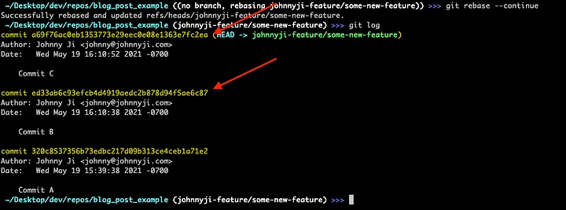

Have you ever come across a PR (pull request) with a commit history that looks like this?



This was commonly how I addressed fixes for my PRs when I first started coding. To my surprise, many engineers far more capable than myself do this as well! You should avoid committing like this because code is communication for both other engineers and your future self.

The cleaner it is, the more sane the readers will be. If there are a bunch of “fix-up” commits obfuscating the actual commit that changed the code’s behavior, it makes it very hard to understand the author’s original intention.

At Distru, whenever we address an issue in a PR, we resolve them in the original commit that introduced the change, to begin with. We accomplish this by using [interactive rebasing](https://git-scm.com/book/en/v2/Git-Tools-Rewriting-History).

### Interactive rebasing

Interactive rebasing is a powerful tool in git that allows you to locally traverse back in history to previous commits, make changes, and essentially rewrite history.

_A word of warning: Your main git branch should act as a historical ledger (and thus not change) once work has been merged in. Interactive rebasing should only be done on open WIP branches that have yet to be merged into the main branch._

Let’s take an example. We have an open PR consisting of the following commits:

*   Commit A
*   Commit B
*   Commit C

Now let’s assume that we've received commentary on Commit B that something needs to be changed. Let’s use interactive rebasing to make this change without additional “fix-up” commits.

1. Stash all current changes (if any) with `git stash` before then trying to rebase
1. Find the hash of the commit you’d like to change by running `git log`

To make changes to Commit B, we’ll need to issue the following command:

```
git rebase -i 400d63a771fc0eefd7409da4bfa6a1f37bfff17b^
```

_You’ll need to add a_ `_^_` _at the end of the commit hash to include that particular commit as a part of your interactive rebase._

After you run this command, you should be at the interactive rebase screen, here you can change `pick` to `edit` for Commit B:



Now you should be able to save the interactive rebase file ( `:wq` on vim), and git will rewind you back in history to being in the midst of Commit B:



Save & quit this file (`:wq` on vim), and the changes you made will now be included as a part of Commit B.

When you’re done with all the changes you’d like to amend, run `git rebase --- continue`, and it’ll fast-forward you to the latest branch head.



Now, if you run `git log`, you can see that your commit history is still as clean as ever while having made amendments to previous commits!



Did you notice how the commit hash for Commit B and any children (in this case, Commit C) change? It changed because you've overwritten those commits by altering history. So to push this up to remote origin, you’ll need to do a force push via `git push -f`.

That’s it! You've just fixed up a previous commit without having to compromise the integrity of your commit history.

### Exploring Other Options

Interactive rebasing is a powerful tool. Editing old commits in place is just one of the many things you can do with it; you can also:

*   [Make “fix up commits” as you would, and then later squash them into your original commit](https://thoughtbot.com/blog/git-interactive-rebase-squash-amend-rewriting-history#squash-commits-together)
*   [Reorder your commit messages](https://thoughtbot.com/blog/git-interactive-rebase-squash-amend-rewriting-history#reword-other-commit-messages-take-2)
*   [Interject commit(s) in between two commits](https://stackoverflow.com/questions/32315156/how-to-inject-a-commit-between-some-two-arbitrary-commits-in-the-past)

All in all, interactive rebasing is a must-have tool to keep your commit history clean; your teammates and your future self will thank you for producing such easily traversable work!
